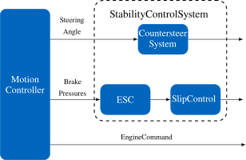
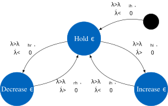

# Stability Control TAM - C++ Implementation

Vehicle stability control system: Anti-Lock Braking (ABS), Traction Control (TC), Electronic Stability Control (ESC), and Countersteer prevention.

## Overview

Modular, control architecture with per-wheel ABS/TC controllers coordinated by a system-level SlipController. Includes ESC for yaw moment control and countersteer as oversteer prevention.

- **ABS**: Prevents wheel lockup during braking
- **TC**: Prevents wheel spin during acceleration  
- **ESC**: Corrects oversteer via differential braking
- **Countersteer**: Proactive oversteer prevention

## Architecture

## Components

### SlipController
Coordinates ABS/TC based on vehicle state:
- Activates ABS during braking (negative longitudinal force)
- Activates TC during acceleration (positive longitudinal force)
- Handles interaction with ESC activations

### ABS
State machine-based pressure modulation:

- Monitors slip relative to target thresholds
- Reduces pressure when slip excessive
- Compensates for load transfer and brake friction changes

### TCControlledWheel (Per-Wheel)
Same state machine as ABS for traction control during acceleration.

- Monitors slip relative to target thresholds
- Increases pressure when slip excessive
- Adapts slip thresholds based on lateral slip angle

### ESC
Yaw moment control via differential braking:
- Tracks reference yaw rate and sideslip angle using references from steady-state bicycle model with linear tires
- Parallel PID loops (yaw rate + sideslip angle)
- Symmetric (if possible) braking distribution on front axle

### CountersteerSystem
Proactive oversteer prevention via steering correction based on steady-state bicycle model